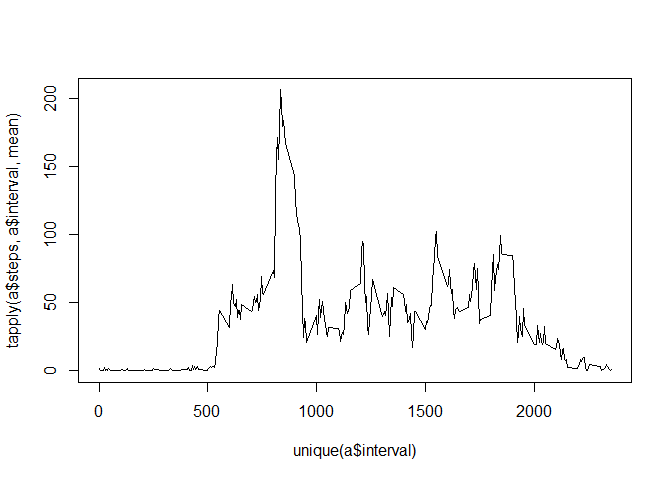

# Reproducible Research: Peer Assessment 1
Vinu George Chandy  


## Loading and preprocessing the data
**Loading and preprocessing the data**  
*Process/transform the data (if necessary) into a format suitable for your analysis*  
*Removing NA values*  

```r
activity_data <- read.csv("activity.csv")
a<-activity_data[complete.cases(activity_data),]
```
  
## What is mean total number of steps taken per day? 
*Generating sum of steps per day*  
*Function used is tapply with the date formated using as.Date()*  

```r
d<-tapply(a$steps,as.Date(a$date),sum)
```
*Histogram of the total number of steps taken each day* 

```r
hist(d,breaks=20)
```


**Calculate and report the mean and median of the total number of steps taken per day**  

```r
total_mean_data <-mean(d)
total_median_data <-median(d)
print(total_mean_data)
```

```
## [1] 10766.19
```

```r
print(total_median_data)
```

```
## [1] 10765
```
## What is the average daily activity pattern?
*Average daily activity pattern @5 minute interval*  

```r
plot(unique(a$interval), tapply(a$steps,a$interval,mean), type = "l")
```



*Imputing missing values*
Calculating number of rows with NA's from the original data set

```r
print(sum(!complete.cases(activity_data)))
```

```
## [1] 2304
```

```
## [1] "There are total  2304  rows with NA's"
```
## Imputing missing values
**Imputing missing values**
Devise a strategy for filling in all of the missing values in the dataset.  
The strategy does not need to be sophisticated.  
Create new dataset that is equal to the original dataset but with the missing data filled in.  

```r
a<-activity_data[complete.cases(activity_data),]  
d<-tapply(a$steps,a$interval,mean,na.rm=TRUE)
valu <- !complete.cases(activity_data)
activity_data$steps[valu] <- d[as.character(activity_data$interval[valu])]
```

*Make a histogram of the total number of steps taken each day*  
Calculate and report the mean and median total number of steps taken per day  

```r
eachday <-tapply(activity_data$steps,as.Date(activity_data$date),sum,na.rm=TRUE)
hist(eachday,breaks=20, xlab = "Sum of Steps Each Day")
```


```r
mean(eachday)
```

```
## [1] 10766.19
```

```r
median(eachday)
```

```
## [1] 10766.19
```
## Are there differences in activity patterns between weekdays and weekends?
**New Data set with weektype using weekdays()**  
Differentiate week and weekends and add this as new column to the existing data set

```r
fdata = NULL
for(i in c(1:nrow(activity_data))){
  wday <- as.Date(activity_data$date[i])
  if(weekdays(wday) == "Sunday" | weekdays(wday) == "Saturday"){
    fdata<-c(fdata,"Weekend")
  } else {
    fdata<-c(fdata,"Weekday")
  }    
}

newdataset<-data.frame(activity_data,fdata)
colnames(newdataset) <- c("steps","date","interval","weektype")
```

*panel plotting showing weekday and weekend*

```r
par(mfrow=c(2,1), mar=c(4, 4, 3, 2))

d1 <- newdataset[newdataset$weektype=="Weekday",]
d1t <-tapply(d1$steps,d1$interval,mean,na.rm=TRUE)
plot(d1t, type="l", main ="Weekday Plot", xlab = "Interval", ylab = "Average of Steps")
d2 <- newdataset[newdataset$weektype=="Weekend",]
d2t <-tapply(d2$steps,d2$interval,mean,na.rm=TRUE)
plot(d2t, type="l", main ="Weekend Plot", xlab = "Interval", ylab = "Average of Steps")
```


